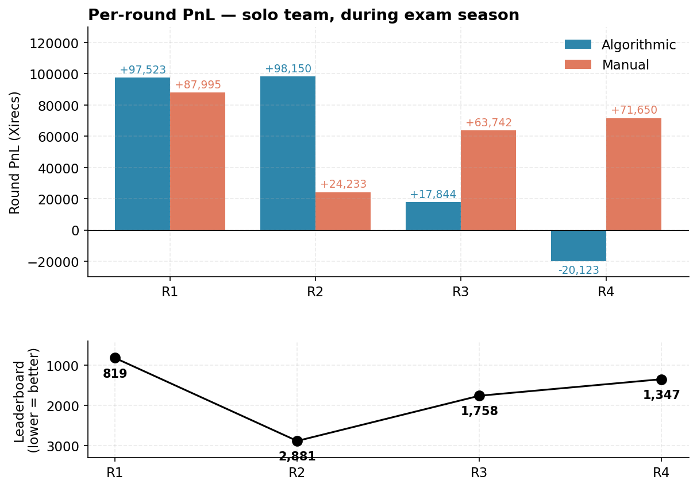
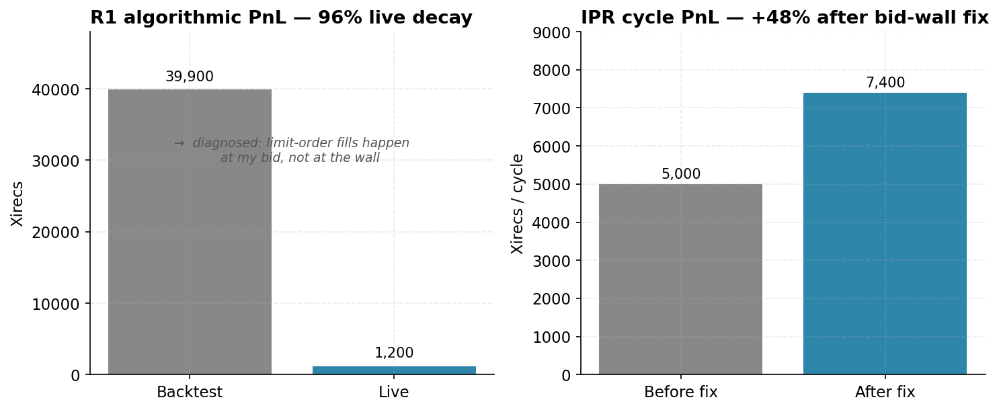
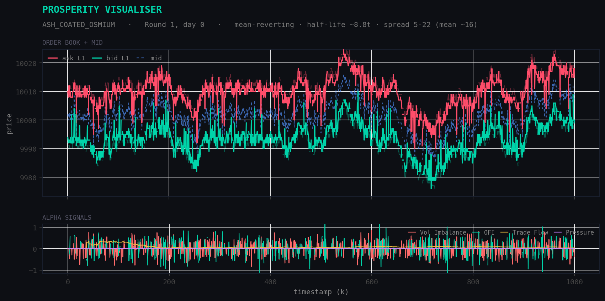
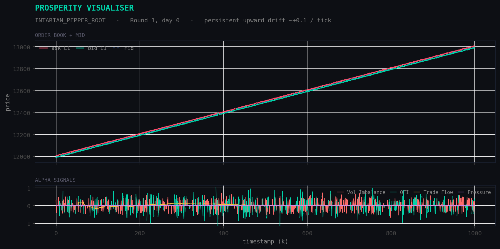
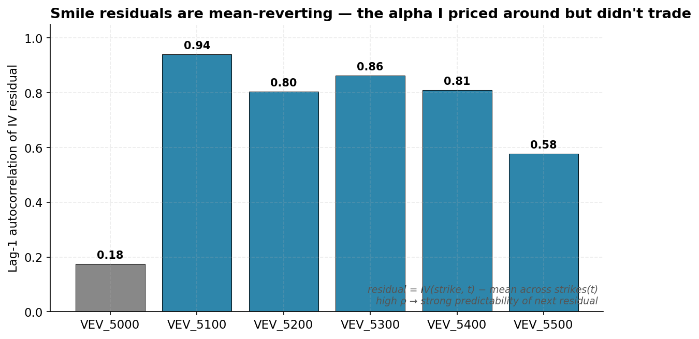

# IMC Prosperity 4

> **Intro — placeholder.** A few lines on what Prosperity is, that I entered solo as Team HCQS, and the one thing I want a reader to take away before they scroll.

IMC Prosperity 4 is a global algorithmic-trading competition run by IMC Trading. Each round, teams submit a Python trading algorithm to a simulated exchange — scored on P&L — alongside a manual-trading puzzle. I competed solo as **Team HCQS**.

## Results at a glance

| Teams | Players | Universities | Countries |
|------:|--------:|-------------:|----------:|
| 18,803 | 30,703 | 1,549 | 117 |

Round PnL = Algorithmic + Manual. "Overall position" is the global leaderboard rank shown that round.

| Round | Overall position | Round PnL | Algo (rank) | Manual (rank) |
|------:|-----------------:|----------:|-------------|---------------|
| 1 | **819** / 18,803 | 185,518 | +97,523 (1118th) | +87,995 (**1st**) |
| 2 | 2,881 / 18,803 | 122,383 | +98,150 (**422nd**) | +24,233 (736th) |
| 3 | 1,758 / 18,803 | 81,586 | +17,844 (1335th) | +63,742 (669th) |
| 4 | 1,347 / 18,803 | 51,527 | −20,123 (2386th) | +71,650 (183rd) |

Did not enter Round 5 (stepped out before the basket-asset round).

A few honest notes before the detail. Overall rank drifted down across R1→R4 (819 → 1,347) as the field's algorithms improved, and the algo book turned negative in R4 (−20,123), offset by a strong manual round (183rd). Manual results were consistently strong (1st, 736th, 669th, 183rd); the algorithmic side peaked at 422nd. Leaderboard captures for each round live in [`ProsperityResults/`](ProsperityResults/).

## What I built — overview

The work in this repo falls into three parts.

**The trader.** A single base trader class providing the infrastructure to interface with IMC's exchange logic, with tailored strategy classes built on top to trade each instrument — so every asset could be isolated, swapped, and tested independently.

**Analysis toolkit.** During the tutorial round I noticed product structures that recur across past years of the competition. To exploit the instruments I expected to reappear, I built a toolkit to characterise any product from scratch — ADF stationarity, variance ratio, Hurst exponent, and OU mean-reversion half-life — classifying it as static, random-walk, mean-reverting, or trending with no hardcoded priors, alongside alpha signals (order-flow imbalance, book pressure, trade-flow) and fair-value estimators (weighted mid, microprice, regression). As the competition continued this extended to options pricing: Black-Scholes valuation, IV smile fitting, and delta attribution.

**Backtesting and visualisation.** I built a backtester to simulate fills, which led to the most valuable discovery of the competition: IMC's exchange fills you at your own limit price, with no price improvement. An early version that filled at the book's best price reported one IPR run at +39,900 in backtest that returned only +1,200 live — a ~30× divergence. Correcting the fill model lifted that strategy's live PnL from ~5k to ~7.4k.

I linked the backtester to an HTML visualiser with per-product tabs, statistics and signals, and fill/missed-trade detail, all aimed at isolating an edge in the data. Maintaining bespoke visualisation tooling on top of the main strategy code eventually outweighed its return for a solo competitor, so I migrated to the community Monte Carlo backtester ([chrispyroberts/imc-prosperity-4](https://github.com/chrispyroberts/imc-prosperity-4), a Rust-backed simulation engine with dashboard) to keep iteration fast.

## Round by round

### Round 1 — Two delta-one products

Round 1 introduced two delta-one products, as expected from previous years, so I ran both my analysis and visualisation pipelines to characterise them. ASH_COATED_OSMIUM was mean-reverting — half-life ≈ 8.8 ticks, wide spreads (5–22, mean ≈ 16) — where passive market-making one tick inside each wall captured the spread. INTARIAN_PEPPER_ROOT looked like the same kind of instrument but carried a persistent upward drift of ~0.1 per tick. Market-making against a steady drift tested poorly, so the edge here was directional: bid at the ask wall to fill fast, accumulate to the position limit (80) early, then hold and let the drift compound over the day.

The Round 1 manual puzzle was a static optimisation: a fixed set of quoted prices through which the goal was to find the single most profitable sequence of trades. I set the problem up by hand to understand its structure, then wrote a solver to enumerate every permutation of the trade sequence and return the one with the optimal fill. This method was successful, with my response ranking 1st of 18,803 teams.

### Round 2 — Auctioned order flow

Round 2 introduced no new products but rather auctioned 25% extra order flow to the top 50% of sealed bids. I proved analytically that market-making never beats buy-and-hold on IPR even with the extra volume, so the access was only worth anything to ASH's market-making. To price my bid, I valued that benefit over the round, then simulated the likely distribution of opponents' bids (weighting in that many teams would bid low or not at all) to find where mine needed to sit. Since paying near the access's full value would only break even, I bid 1,000 Xirecs: above the likely median but well under the value, securing the access with room to spare.

I also added an EMA fair-value tracker feeding spread-conditional directional bets to the ASH maker, which lifted its three-day backtested PnL by ~8,200. This was my strongest algorithmic round: 422nd globally on the algo leaderboard, around the top 2%.

### Round 3 — Options appear

Round 3 began to introduce options, and is where my learning was really pushed. The "vouchers" functioned as European call options on VELVETFRUIT_EXTRACT across multiple strike prices. I built the options infrastructure from scratch — Black-Scholes pricing, an implied-vol solver, and IV smile fitting. I then identified an apparent alpha: each voucher's implied vol, minus its fitted-smile value, appeared to mean-revert.

Rather than assume it, I tested it — an AR(1) persistence fit plus mean-reversion half-life and a t-test on the residual mean, flagging a strike as tradeable only when the half-life was short and the mean was significant (|t| > 3). I sized the opportunity with vega, the option's price sensitivity to implied vol: a one-sigma mispricing is worth σ_resid × vega per contract, so a full reversion round-trip (rich to cheap, ≈ 2σ) is worth roughly 2·σ_resid·vega.

But once implemented, a grid search over parameters showed the reversion-harvesting model beat baseline by only ~1.5% at a single setting and underperformed at almost every other. I concluded it wasn't a true edge and reverted to market-making.

### Round 4 — The long-vol miss

Round 4 kept the options market (vouchers on VELVETFRUIT_EXTRACT, plus HYDROGEL_PACK), and is the round I lost money on — though the most instructive for it. By parsing the counterparty names on the trade tape, I identified specific bots whose flow was informed: conditioning forward returns on each counterparty's fills and t-testing the result, three names stood out — when "Mark 67" bought, the underlying rose ~+1.95 ticks over the next 200 ticks (t ≈ 19.7), with two others firing significantly on the sell side (t ≈ −14.9 and −8.1). I built a signal-driven options trader around this, taking vouchers aggressively in the signal's direction whenever an informed bot had recently fired, but couldn't convert the signal into reliable profit in testing.

With my overall rank slipping as the field's algorithms improved, I chose to take on more risk than in previous rounds to try to close the gap: a higher-conviction directional long-volatility position rather than the market-neutral making I'd leaned on before. However, in practice the underlying was effectively stationary, so the long-vol book simply bled theta, and the round closed −20,123.

### Round 5 — Stepping back

With exam season peaking and the introduction of a plethora of statistical-arbitrage baskets and assets to analyse as a solo competitor, I made the call to step back from the final round. Finishing my first attempt with a much sharper understanding of the problem space — and a clear plan to return better prepared next year.

## The analysis toolkit

[`IMCProsperity/Analysis`](IMCProsperity/Analysis) contains tools to categorise the instruments supplied, from raw order-book and trade CSVs, as well as attempting to identify potential alpha signals and the fair value of each product.

`stat_utils.py` — runs statistical tests to identify mean-reversion factors like stationarity and half-life, along with tests like chi-squared and z-tests to gauge significance and validate claims before their implementation.

`alpha_signals.py` — gives normalised signals over [−1, 1] across factors such as volume imbalance and order flow, blending them into one composite signal.

`fv_estimator.py` — uses multiple methods to test the fair value of products, introducing concepts such as Stoikov imbalance and cross-validating them against each other to identify a best estimate.

Plumbing: `loader.py` stitches days together and manages the CSVs, `run_analysis.py` runs characterisation in one pipeline, and `adverse_selection.py` identifies toxic vs good fills.

## The visualisation toolkit

[`IMCProsperity/Visualisation`](IMCProsperity/Visualisation) simulates how a strategy would have filled against historical data and renders the result into an interactive HTML page to isolate where the edge is.

`backtester.py` — simulates fills against the recorded book, modelling both aggressive crosses and inside-spread passive fills. This is where I found IMC fills you at your own limit price with no price improvement; it outputs a fill log and mark-to-market PnL per day.

`visualiser.py` — takes that fill log plus the raw data and builds a single HTML page with per-product tabs, overlaying fair-value estimates and alpha signals from the analysis toolkit, summary statistics, and the actual fills. It also flags missed trades, where a bot traded but I was stuck at the position limit.

## The options pricing toolkit

Built from scratch in Round 3 when the vouchers appeared — European call options on VELVETFRUIT_EXTRACT across multiple strikes. The goal was to price every voucher, fit the volatility surface, and test whether the mispricings were tradeable.

`options.py` — the core pricing engine: Black-Scholes valuation and Greeks (delta, vega) under the competition's r = q = 0 regime, plus a Newton-Raphson implied-vol solver with a bisection fallback for robustness. Strikes are compared in log-moneyness m = ln(K/S)/√T, which keeps the smile roughly time-invariant.

`smile_analysis.py` — fits a quadratic IV smile in moneyness at each snapshot and tracks every strike's residual (how rich or cheap it is versus the fitted curve) over time, the signal I tested for mean-reversion.

`iv_report.py` — one-shot diagnostic: per-strike residuals, residual half-life, realised-vs-implied vol gap, and strike liquidity, to judge whether an edge was real before building a strategy on it.

## Reflections

> **Reflections — placeholder.** What I'd build differently next time (walk-forward backtesting with cost modelling baked in; an options engine that treats theta as a sizing constraint), and what the arc taught me about edge, discipline, and competing solo.
